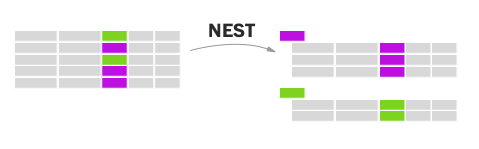

# Data storytelling D3 workshop

Workshop given at AAAS data storytelling conference by John Muyskens on Friday July 14, 2017

## 1. Intro to this workshop
- goal is for you to get a feel for library and get comfortable reading docs
- also learn some conventions - not the only way to do things!
- d3 is a toolkit, not a 3D printer
- what to use it for + what not to use it for

d3 is a powerful, low level toolkit for creating data-driven documents. It is overkill for basic charts, but if you need custom chart types, interaction, or you want to build your own charting library d3 is good to know. It can produce HTML and SVG documents or draw on a Javascript canvas.

[Docs: everything D3 can do](https://github.com/d3/d3/blob/master/API.md)

[Blockbuilder: write your code here in this in interactive editor](http://blockbuilder.org/jmuyskens/4a3c352e1979e3d61eac78ffa8c2f205)

## 2. Intro to SVG

Scalable Vector Graphics is a vector image format. It can be viewed with modern browsers and edited with programs like Adobe Illustrator or Inkscape (open source).

- [Docs: SVG rect](https://developer.mozilla.org/en-US/docs/Web/SVG/Element/rect)
- [Docs: SVG circle](https://developer.mozilla.org/en-US/docs/Web/SVG/Element/circle)
- [Docs: SVG text](https://developer.mozilla.org/en-US/docs/Web/SVG/Element/text)
- [Docs: SVG path](https://developer.mozilla.org/en-US/docs/Web/SVG/Element/path)

Demo: create an SVG

Task: create an SVG with a rect, circle, text and path.

EXTRA CREDIT: draw a snowman

[what it should look like](http://blockbuilder.org/jmuyskens/fbd18e5da34a79bc75e4251eaaf32075)

## 3. Creating SVG with D3
- [Docs: D3 selection](https://github.com/d3/d3-selection)

TASK: draw the same shape with d3

[what it should look like](http://blockbuilder.org/jmuyskens/8f3479da5a5e6c39354c3d91eb9f3420)

## 4. SVG grouping and transforming
- [Docs: SVG g](https://developer.mozilla.org/en-US/docs/Web/SVG/Element/g)
- [Docs: SVG transform attribute](https://developer.mozilla.org/en-US/docs/Web/SVG/Attribute/transform)

Task: group some elements together and transform them.

Extra credit: rotate your group.

[what it should look like](http://blockbuilder.org/jmuyskens/7005c0c0494b6e5d148103a24aecdf2d)

## 5. The margin convention

Demo: setting up a basic chart, my first steps with any D3 work

[what it should look like](http://blockbuilder.org/jmuyskens/11e29494c473d71665d28e802db2d7b3)

## 6. Functional programming and data analysis

First, lets load our data: [Docs: d3.csv](https://github.com/d3/d3-request/blob/master/README.md#csv).

    d3.csv(‘oecd.csv’, function(data) { // do things with the data });

Take a look at your data using `console.log(data)` or `console.table(data)` if you are fancy.

Now let’s play with the data, using built in Array functions:

- [docs: Array.filter](https://developer.mozilla.org/en-US/docs/Web/JavaScript/Reference/Global_Objects/Array/filter)
- [docs: Array.map](https://developer.mozilla.org/en-US/docs/Web/JavaScript/Reference/Global_Objects/Array/map)

TASK: filter out values where one or both are NA. Then create an Array of life expectancies.

Finally, lets play with some helpful [d3-array](https://github.com/d3/d3-array/) functions:

[d3.max](https://github.com/d3/d3-array/#max), [d3.min](https://github.com/d3/d3-array/#min), [d3.mean](https://github.com/d3/d3-array/#mean), [d3.median](https://github.com/d3/d3-array/#median), [d3.extent](https://github.com/d3/d3-array/#extent)

http://blockbuilder.org/jmuyskens/4fec60116f5eb5f81edd4380786f8fca

## 7. Scales
[Docs: d3-scale](https://github.com/d3/d3-scale)

First, choose what variable goes on each axis. We will be doing spending on x and life expectancy on y

    var xScale = d3.scaleLinear()
        .domain([0, d3.max(healthExpenditures)])
        .range([0, width]);

Task: write the y scale, using the extent of the life expectancy for the domain. Note that zero in SVG is at the top of the image, so you’ll want to flip your range.

[what it should look like](http://blockbuilder.org/jmuyskens/2d204aee4551d81e0d6ac69fc2c544d3)

## 8. Basic enter pattern
Live coding: add circles

Task: add some text following the same enter pattern. Note: Use a class in your selection (like ‘text.label’) to differentiate your labels from the text in the axes. Remember to add the class to the text. I would suggest using `transform` for placement so you can use `dx` and `dy` for tweaking placement.

There are a ton of labels! Filter out some so we can annotate just a few countries of interest.

http://blockbuilder.org/jmuyskens/9831944f2ccc77f86e627df0c28c9815

## 9. Axes
[Docs: D3 axis](https://github.com/d3/d3-axis)

Demo: create an x axis

Task: create a y axis

The backbone of the axis is a `<path>` while the ticks are `<line>`s so you can easily style them separately with CSS.

We can make a dashed line with `stroke-dasharray: TKpx TKpx;`.

Task: reduce the number of ticks, make the y axis ticks extend across the chart

Use a `transform` to move your axis around.

Play with the following:

`.tickSize` to specify length of ticks. Try making your axes as wide and tall as your chart.

`.ticks` to specify number of ticks

`.tickFormat` format the tick

[Docs: axis ticks](https://github.com/d3/d3-axis#axis_ticks)

http://blockbuilder.org/jmuyskens/4d7467f86e731a58848947118923e6f8

## 10. Grouping data
Goal is to structure your data the way you want your DOM to look.

`Nest` is like "groupBy" in other functional programming languages

[Docs: d3.nest](https://github.com/d3/d3-collection#nests)

`.entries` returns an array

`.map` returns an object which is useful for creating lookup tables. There's also `.object` which you can use if you are sure your data doesn't collide with js reserved words. JS objects not equal to hash tables like python dicts but can be used in much the same way.

Try it out with [Mr. Nester](http://bl.ocks.org/jmuyskens/raw/349d82067d82ce121fcd6773dc6db3a1/).

create an object called `dataByYear` and use it with your circle selection. Try different years

Now repeat the excercise using `.entries`. Note that the structure changes.

http://blockbuilder.org/jmuyskens/4a0e5f282699b88082bf426b10ee1d21

## 11. Advanced update pattern

docs: enter pattern example

Demo: create an update function

timer function:

    var i = 0;
    d3.interval(function() {
        if (i < dataByYear.length) update(dataByYear[i++].values);
    }, 500);

[what it should look like](http://blockbuilder.org/jmuyskens/115fdf97bf8d6ea85f981a921303619b)

## 12. Label your data

Task extend your update pattern to the labels labels so they also update

[what it should look like](http://blockbuilder.org/jmuyskens/d67b2dc414a7402c2ba0e7b907987663)

## 13. Interaction

When entering or adding elements chain `.on(EVENTNAME, callback)`. Similar to jQuery, this calls a function when an event happens.

D3 will call your callback function with the datum like you get in other accessor functions. Use `d3.select(this)` to select the element that was triggered.

Some events:
- mouseenter
- mouseleave
- mouseover
- click

Demo: create a mouseover function for the circles

Task: make a replay “button” that triggers when you `’click’` it.

[what it should look like](http://blockbuilder.org/jmuyskens/83301f798ac9eea6c7fbe1b0f4ef5e15)

## 14. Add a path

[Docs: d3.line](https://github.com/d3/d3-shape#lines)

Task: nest your data by country, then create a d3.line generator

Extra credit: animate the line into view

[what it should look like](http://blockbuilder.org/jmuyskens/dae9a87c345d152a7af5ad7ddd86b746)

## 15. Transitions

[Docs: d3 transition](https://github.com/d3/d3-transition)

Live coding: add transition to circles for position and radius

Task: add transition to text. Try out different easing patterns.

[what it should look like](http://blockbuilder.org/jmuyskens/8f445ec8e9f0a24bb9ca03ccaa599297)

# what's in the advanced class
- Voronoi
- Layouts (force, hierarchy)
- Geo tools
- Modules
- Behaviors (drag and zoom)
- Canvas

# libraries and tools you may find useful
[crowbar](http://nytimes.github.io/svg-crowbar/) to download your chart as an SVG. You can then edit it using vector graphics software such as Adobe Illustrator.

[d3-jetpack](https://www.npmjs.com/package/d3-jetpack) for convenience functions that will save you a lot of repetitive typing.

[d3-legend](http://d3-legend.susielu.com/) to make convenient legends based on your scales.

[Textures.js](https://riccardoscalco.github.io/textures/) to use patterns in your visualizations.

[Swoopy drag](https://github.com/1wheel/swoopy-drag) for interactive annotations.

[Improved path transitions](https://bocoup.com/blog/improving-d3-path-animation)

